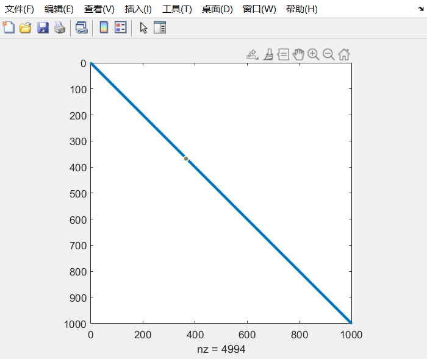

# Assignment 3
## 2.5 Computer Problems: 2
**Q:**
Use the Jacobi Method to solve the sparse system within three correct decimal places (forward error in the infinity norm) for n = 100. The correct solution is [1,−1,1,−1,...,1,−1]. Report the number of steps needed and the backward error. The system is
$$
\left[
\begin{matrix}
2 & 1\\
1 & 2 & 1\\
 & \ddots & \ddots & \ddots\\
 &  & 1 & 2 & 1 \\
&  &  & 1 & 2
\end{matrix}
\right]
\left[
\begin{matrix}
x_1 \\
\\
\vdots \\
\\
x_n \\
\end{matrix}
\right]=
\left[
\begin{matrix}
1 \\
0 \\
\vdots \\
0\\
-1 \\
\end{matrix}
\right].
$$

**A:**
**code:**
sparsesetup.m:

    function [a,b] = sparsesetup(n)
    e = ones(n,1);
    a = spdiags([e 2*e e],-1:1,n,n);            % Entries of a
    b=zeros(n,1);                               % Entries of r.h.s. b
    b(1)=1;b(n)=-1;

jacobi.m:

    function [x,j,be] = jacobi(a,b,tol)
    n=length(b);    % find n
    d=diag(a);      % extract diagonal of a
    r=a-diag(d);    % r is the remainder
    x=zeros(n,1);   % initialize vector x
    x_true = ones(n,1);
    for i=2:2:100
        x_true(i)=-1;
    end
    for j=1:50000   % loop for Jacobi iteration
        x = (b-r*x)./d;
        error = norm(x-x_true,inf); % FE
        be = norm(b-a*x,inf);       % BE
        if (error < tol)
            break
        end
    end             % End of Jacobi iteration loop

main.m:

    format long
    [a,b]=sparsesetup(100);
    [x, steps,be] = jacobi(a,b,0.001);
    steps
    be
**results:**

    steps =

        14776

    be =

        9.674122976033317e-07
Therefore, the number of steps needed is 14776, and the backward error is 9.674122976033317e-07.

## 2.5 Computer Problems: 6
**Q:**
Carry out the steps of Computer Problem 2 for (a) Gauss–Seidel Method and (b) SOR with ω = 1.5.

**A:**
**(a)**
**code:**
sparsesetup.m:

    function [a,b] = sparsesetup(n)
    e = ones(n,1);
    a = spdiags([e 2*e e],-1:1,n,n);            % Entries of a
    b=zeros(n,1);                               % Entries of r.h.s. b
    b(1)=1;b(n)=-1;

GS.m:

    function [x,j,be] = GS(a,b,tol)
    n=length(b);    % find n
    d=diag(a);      % extract diagonal of a
    d=diag(d);
    u=triu(a)-d;
    l=tril(a)-d;
    x=zeros(n,1);   % initialize vector x
    x_true = ones(n,1);
    for i=2:2:100
        x_true(i)=-1;
    end

    for j=1:50000   % loop for GS iteration
        x = (d+l)\(b-u*x);
        error = norm(x-x_true,inf); % FE
        if (error < tol)
            break
        end
        be = norm(b-a*x,inf);       % BE
    end             % End of GS iteration loop
main.m:

    format long
    [a,b]=sparsesetup(100);
    [x, steps,be] = GS(a,b,0.001);
    steps
    be
**results:**

    steps =

            7389

    be =

        9.688609748925714e-07
Therefore, the number of steps needed is 7389, and the backward error is 9.688609748925714e-07.

**(b)**
sparsesetup.m:

    function [a,b] = sparsesetup(n)
    e = ones(n,1);
    a = spdiags([e 2*e e],-1:1,n,n);            % Entries of a
    b=zeros(n,1);                               % Entries of r.h.s. b
    b(1)=1;b(n)=-1;
SOR.m:

    function [x,j,be] = SOR(a,b,omega,tol)
    n=length(b);    % find n
    d=diag(a);      % extract diagonal of a
    d=diag(d);
    u=triu(a)-d;
    l=tril(a)-d;
    x=zeros(n,1);   % initialize vector x
    x_true = ones(n,1);
    for i=2:2:100
        x_true(i)=-1;
    end

    for j=1:50000   % loop for GS iteration
        x = (omega*l+d)\((1-omega)*d*x-omega*u*x)+omega*((d+omega*l)\b);
        error = norm(x-x_true,inf); % FE
        if (error < tol)
            break
        end
        be = norm(b-a*x,inf);       % BE
    end             % End of GS iteration loop
main.m:

    format long
    [a,b]=sparsesetup(100);
    [x,steps,be] = SOR(a,b,1.25,0.001);
    steps
    be
**results:**

    steps =

            4433

    be =

        9.695012020971561e-07
Therefore, the number of steps needed is 4433, and the backward error is  9.695012020971561e-07.
## 2.6 Exercises: 13(a)
**Q:**
Solve the problems by carrying out the Conjugate Gradient Method by hand.
$$
(a)\left[
    \begin{matrix}
    1 & 2 \\
    2 & 5 \\
    \end{matrix}
\right]
\left[
    \begin{matrix}
    u \\
    v \\
    \end{matrix}
\right]=
\left[
    \begin{matrix}
    1 \\
    1 \\
    \end{matrix}
\right]
$$

**A:**
$
x_0=
\left[
    \begin{matrix}
    0 \\
    0 \\
    \end{matrix}
\right]
$
$
r_0=d_0=
\left[
    \begin{matrix}
    1 \\
    1 \\
    \end{matrix}
\right]
$
$
\alpha_0=\frac{\left[\begin{matrix}1\\1\end{matrix}\right]^T\left[\begin{matrix}1\\1\end{matrix}\right]}{\left[\begin{matrix}1\\1\end{matrix}\right]^T\left[\begin{matrix} 1 & 2\\2 & 5\end{matrix}\right]\left[\begin{matrix}1\\1\end{matrix}\right]}=\frac{1}{5}
$
$
x_1=\left[\begin{matrix}0\\0\end{matrix}\right]+\frac{1}{5}\left[\begin{matrix}1\\1\end{matrix}\right]=\left[\begin{matrix}\frac{1}{5}\\\frac{1}{5}\end{matrix}\right]
$
$
r_1=\left[\begin{matrix}1\\1\end{matrix}\right]-\frac{1}{5}\left[\begin{matrix}3\\7\end{matrix}\right]=\left[\begin{matrix}\frac{2}{5}\\-\frac{2}{5}\end{matrix}\right]
$
$
\beta_0=0.16
$
$
d_1=\left[\begin{matrix}\frac{2}{5}\\-\frac{2}{5}\end{matrix}\right]+0.16\left[\begin{matrix}1\\1\end{matrix}\right]=\left[\begin{matrix}0.56\\-0.24\end{matrix}\right]
$
$
\alpha_1=\frac{\left[\begin{matrix}\frac{2}{5}\\-\frac{2}{5}\end{matrix}\right]^T\left[\begin{matrix}\frac{2}{5}\\-\frac{2}{5}\end{matrix}\right]}{\left[\begin{matrix}0.56\\-0.24\end{matrix}\right]^T\left[\begin{matrix}1&2\\2&5\end{matrix}\right]\left[\begin{matrix}0.56\\-0.24\end{matrix}\right]}=\frac{0.32}{0.064}=5
$
$
x_2=\left[\begin{matrix}0.2\\0.2\end{matrix}\right]+5\left[\begin{matrix}0.56\\-0.24\end{matrix}\right]=\left[\begin{matrix}3\\-1\end{matrix}\right]
$
$
r_2=\left[\begin{matrix}0.4\\-0.4\end{matrix}\right]-5\left[\begin{matrix}0.08\\-0.08\end{matrix}\right]=0
$
Since $r_2=0$, the solution is $x_2=[3,−1]$.
## 2.6 Computer Problems: 6
**Q:**
Let A be the n × n matrix with n = 1000 and entries A(i, i) = i, A(i, i + 1) = A(i + 1,i) = 1/2,A(i, i + 2) = A(i + 2,i) = 1/2 for all i that fit within the matrix. 
(a) Print the nonzero structure spy(A). 
(b) Let $x_e$ be the vector of n ones. Set $b = Ax_e$, and apply the Conjugate Gradient Method, without preconditioner, with the Jacobi preconditioner, and with the Gauss–Seidel preconditioner. Compare errors of the three runs in a plot versus step number.

**A:**
**(a)**
sparsesetup.m:

    function a = sparsesetup(n)
    e = ones(n,1);
    a = spdiags([0.5*e 0.5*e e 0.5*e 0.5*e],-2:2,n,n);
    for i=1:n
        a(i,i)=i;
    end
main.m:

    format long
    a=sparsesetup(1000);
    spy(a);
**results:**
