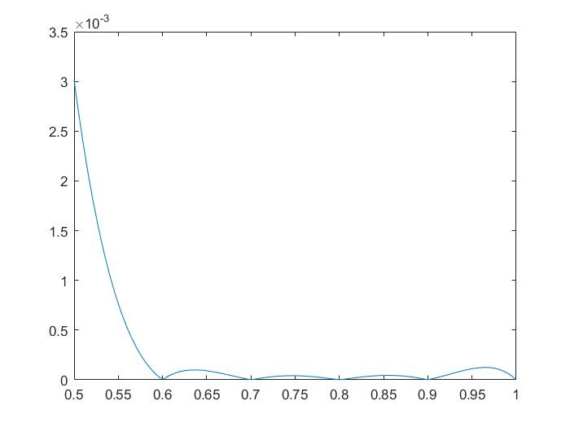
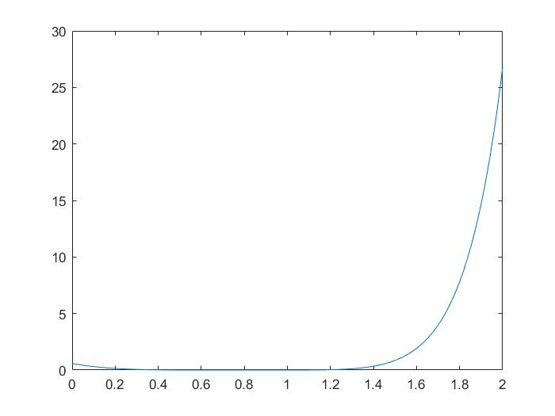
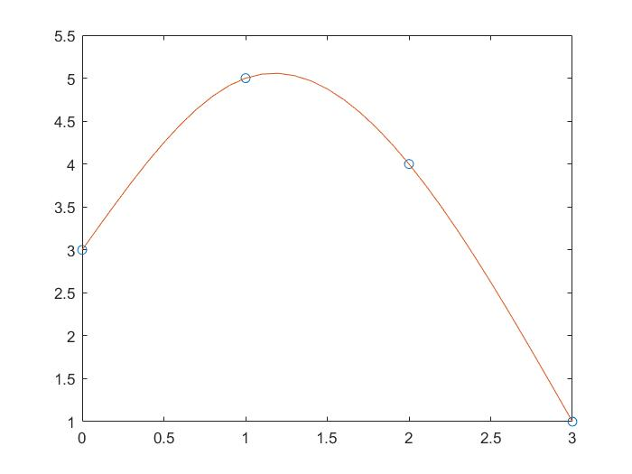
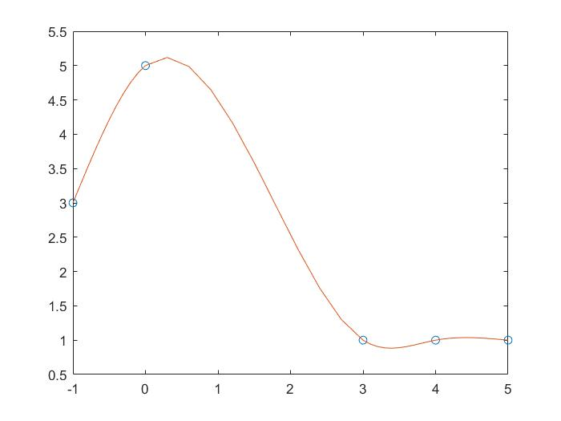

#  Assignment 4
## 3.1 Exercises: 1(b)
**Q:**
Use Lagrange interpolation to find a polynomial that passes through the points.
(b) (−1,0), (2,1), (3,1), (5,2)

**A:**
$
P(x)=0+1\frac{(x+1)(x-3)(x-5)}{(2+1)(2-3)(2-5)}+1\frac{(x+1)(x-2)(x-5)}{(3+1)(3-2)(3-5)}+2\frac{(x+1)(x-2)(x-3)}{(5+1)(5-2)(5-3)}=\frac{1}{9}(x^2-2x-3)(x-5)-\frac{1}{8}(x^2-x-2)(x-5)+\frac{1}{18}(x^2-x-2)(x-3)=\frac{1}{9}(x^3-7x^2+7x+15)-\frac{1}{8}(x^3-6x^2+3x+10)+\frac{1}{18}(x^3-4x^2+x+6)=\frac{1}{24}x^3-\frac{1}{4}x^2+\frac{11}{24}x+\frac{3}{4}
$

## 3.1 Exercises: 2(b)
**Q:**
Use Newton’s divided differences to find the interpolating polynomials of the points in Exercise 1, and verify agreement with the Lagrange interpolating polynomial.
(b) (−1,0), (2,1), (3,1), (5,2)

**A:**
$$
\begin{matrix}
-1&0\\
&&\frac{1}{3}\\
2&1&&-\frac{1}{12}\\
&&0&&\frac{1}{24}\\
3&1&&\frac{1}{6}\\
&&\frac{1}{2}\\
5&2\\
\end{matrix}
$$
$P(x)=0+\frac{1}{3}(x+1)-\frac{1}{12}(x+1)(x-2)+\frac{1}{24}(x+1)(x-2)(x-3)=\frac{1}{3}(x+1)-\frac{1}{12}(x^2-x-2)+\frac{1}{24}(x^3-4x^2+x+6)=\frac{1}{24}x^3-\frac{1}{4}x^2+\frac{11}{24}x+\frac{3}{4}$
It's the same as Exercise 1.

## 3.1 Computer Problems: 3
**Q:**
Write a Matlab function polyinterp.m that takes as input a set of (x, y) interpolating points and another x0, and outputs y0, the value of the interpolating polynomial at x0. The first line of the file should be function y0 = polyinterp(x,y,x0), where x and y are input vectors of data points. Your function may call newtdd from Program 3.1 and nest from Chapter 0, and may be structured similarly to Program 3.2, but without the graphics.Demonstrate that your function works.

**A:**
**code:**
polyinterp.m:

    function y0=polyinterp(x,y,x0)
    n = length(x);          % n is the degree of the polynomial
    for j=1:n
        v(j,1)=y(j);        % Fill in y column of Newton triangle
    end
    for i=2:n               % For column i,
        for j=1:n+1-i       % fill in column from top to bottom
            v(j,i)=(v(j+1,i-1)-v(j,i-1))/(x(j+i-1)-x(j));
        end
    end
    for i=1:n
        c(i)=v(1,i);        % Read along top of triangle
    end                     % for output coefficients
    y0 = nest(n-1,c,x0,x);
nest.m:

    %Program 0.1 Nested multiplication
    %Evaluates polynomial from nested form using Horner’s Method
    %Input: degree d of polynomial,
    % array of d+1 coefficients c (constant term first),
    % x-coordinate x at which to evaluate, and
    % array of d base points b, if needed
    %Output: value y of polynomial at x
    function y=nest(d,c,x,b)
    if nargin<4, b=zeros(d,1); end
    y=c(d+1);
        for i=d:-1:1
    y = y.*(x-b(i))+c(i);
    end
main.m:

    x0=[-1 2 3 5];
    y0=[0 1 1 2];
    c=polyinterp(x0,y0,0);
    c
**results:**

    c =

        3/4  
We Use the program to find the interpolating polynomials of the points in Exercise 1(b), and let x0=0, then y0 is obviously 3/4.

##3.2 Exercises: 1
**Q:**
(a) Find the degree 2 interpolating polynomial $P_2(x)$ through the points (0,0), (π/2,1), and (π,0). 
(b) Calculate $P_2(π/4)$, an approximation for sin(π/4). 
(c) Use Theorem 3.3 to give an error bound for the approximation in part (b). 
(d) Using a calculator or Matlab, compare the actual error to your error bound.

**A:**
**(a)**
$$
\begin{matrix}
0&0\\
&&2/\pi\\
\pi/2&1&&-4/\pi^2\\
&&-2/\pi\\
\pi&0\\
\end{matrix}
$$
$P_2(x)=0+\frac{2}{\pi}x-\frac{4}{\pi^2}x(x-\frac{\pi}{2})=-\frac{4}{\pi^2}x^2+\frac{4}{\pi}x$
**(b)**
$P_2(\frac{\pi}{4})=-\frac{1}{4}+1=\frac{3}{4}$
**(c)**
**Q:**
$f(x)-P_2(x)=\frac{x(x-\frac{\pi}{2})(x-\pi)}{3!}f^{(3)}(c)$
$f^{(3)}(c)=cos(c)\le1$
$|f(\frac{\pi}{4})-P_2(\frac{\pi}{4})|\le\frac{\pi^4}{128}\approx0.242$
**(d)**
$|f(\frac{\pi}{4})-P_2(\frac{\pi}{4})|=|\frac{3}{4}-\frac{\sqrt{2}}{2}|\approx0.043$
## 3.2 Computer Problems: 1
(a) Use the method of divided differences to find the degree 4 interpolating polynomial $P_4(x)$ for the data (0.6,1.433329), (0.7,1.632316), (0.8,1.896481), (0.9,2.247908), and (1.0,2.718282). 
(b) Calculate $P_4(0.82)$ and $P_4(0.98)$. 
(c) The preceding data come from the function $f (x) = e^{x^2}$. Use the interpolation error formula to find upper bounds for the error at x = 0.82 and x = 0.98, and compare the bounds with the actual error. 
(d) Plot the actual interpolation error P (x) − $e^{x^2}$ on the intervals [0.5,1] and [0,2]

**A:**
**(a)**
**code:**
newtdd.m:

    %Program 3.1 Newton Divided Difference Interpolation Method
    %Computes coefficients of interpolating polynomial
    %Input: x and y are vectors containing the x and y coordinates
    % of the n data points
    %Output: coefficients c of interpolating polynomial in nested form
    %Use with nest.m to evaluate interpolating polynomial
    function c=newtdd(x,y,n)
    for j=1:n
        v(j,1)=y(j); % Fill in y column of Newton triangle
    end
    for i=2:n % For column i,
        for j=1:n+1-i % fill in column from top to bottom
            v(j,i)=(v(j+1,i-1)-v(j,i-1))/(x(j+i-1)-x(j));
        end
    end
    for i=1:n
        c(i)=v(1,i); % Read along top of triangle
    end % for output coefficients
main.m:

    x0=[0.6 0.7 0.8 0.9 1.0];
    y0=[1.433329 1.632316 1.896481 2.247908 2.718282];
    c=newtdd(x0,y0,5)
**results:**

    c =

    列 1 至 2

    1.433329000000000   1.989870000000001

    列 3 至 4

    3.258899999999984   3.680666666666721

    列 5

    4.000416666666682
$P_4(x)=1.433329+(x-0.6)(1.98987+(x-0.7)(3.2589+(x-0.8)(3.680667+(x-0.9)(4.000417))))$
**(b)**
$P_4(0.82)=1.95891$
$P_4(0.98)=2.61285$
**(c)**
$|f(x)-P(x)|=\frac{(x-0.6)(x-0.7)(x-0.8)(x-0.9)(x-1)}{5!}f^{(5)}(c)$
code:

    syms x
    f = exp(x.^2);
    g = diff(f,5)
results:

    g =
    
    120*x*exp(x^2) + 160*x^3*exp(x^2) + 32*x^5*exp(x^2)
$f^{(5)}(c)\le(120+160+32)e\approx848.1039$
$|f(0.82)-P(0.82)|\le0.0000537$, actual error=0.0000234
$|f(0.98)-P(0.98)|\le0.000217$, actual error=0.000107
**(d)**
**code:**

    x=linspace(0.5, 1);
    y=abs1.433329+(x-0.6).*(1.98987+(x-0.7).*(3.2589+(x-0.8).*(3.680667+(x-0.9).*(4.000417))))-exp(x.^2));
    plot(x,y);
**results:**

**code:**
x=linspace(0,2);
y=abs(1.433329+(x-0.6).*(1.98987+(x-0.7).*(3.2589+(x-0.8).*(3.680667+(x-0.9).*(4.000417))))-exp(x.^2));
plot(x,y);
**results:**

##  3.3 Computer Problems: 2
**Q:**
Build a Matlab program to evaluate the cosine function correct to 10 decimal places using Chebyshev interpolation. Start by interpolating on a fundamental domain [0,π/2], and extend your answer to inputs between −104 and 104. You may want to use some of the Matlab code written in this chapter.

**A:**
$\frac{(\frac{\pi}{4})^{10}}{10!2^9}\approx0.481*10^{-10}<10^{-10}$
So, let n=10.
**code:**
cos2.m:

    function y=cos2(x)
    %First calculate the interpolating polynomial and
    % store coefficients
    n=10;
    b=pi/4+(pi/4)*cos((1:2:2*n-1)*pi/(2*n));
    yb=cos(b);      % b holds Chebyshev base points
    c=newtdd(b,yb,n);
    %For each input x, move x to the fundamental domain and evaluate
    % the interpolating polynomial
    s=1;            % Correct the sign of sin
    x1=mod(x,2*pi);
    if x1>pi
        x1 = 2*pi-x1;
    end
    if x1 > pi/2
        x1 = pi-x1;
        s=-1;
    end
    y = s*nest(n-1,c,x1,b);
## 3.4 Computer Problems: 1
**Q:**
Find the equations and plot the natural cubic spline that interpolates the data points
(a) (0,3), (1,5), (2,4), (3,1) 
(b) (−1,3), (0,5), (3,1), (4,1), (5,1).

**A:**
**code:**
splinecoeff.m:

    %Program 3.5 Calculation of spline coefficients
    %Calculates coefficients of cubic spline
    %Input: x,y vectors of data points
    % plus two optional extra data v1, vn
    %Output: matrix of coefficients b1,c1,d1;b2,c2,d2;...
    function coeff=splinecoeff(x,y)
    n=length(x);v1=0;vn=0;
    A=zeros(n,n); % matrix A is nxn
    r=zeros(n,1);
    for i=1:n-1 % define the deltas
        dx(i)= x(i+1)-x(i); dy(i)=y(i+1)-y(i);
    end
    for i=2:n-1 % load the A matrix
        A(i,i-1:i+1)=[dx(i-1) 2*(dx(i-1)+dx(i)) dx(i)];
        r(i)=3*(dy(i)/dx(i)-dy(i-1)/dx(i-1)); % right-hand side
    end
    % Set endpoint conditions
    % Use only one of following 5 pairs:
    A(1,1) = 1; % natural spline conditions
    A(n,n) = 1;
    %A(1,1)=2;r(1)=v1; % curvature-adj conditions
    %A(n,n)=2;r(n)=vn;
    %A(1,1:2)=[2*dx(1) dx(1)];r(1)=3*(dy(1)/dx(1)-v1); %clamped
    %A(n,n-1:n)=[dx(n-1) 2*dx(n-1)];r(n)=3*(vn-dy(n-1)/dx(n-1));
    %A(1,1:2)=[1 -1]; % parabol-term conditions, for n>=3
    %A(n,n-1:n)=[1 -1];
    %A(1,1:3)=[dx(2) -(dx(1)+dx(2)) dx(1)]; % not-a-knot, for n>=4
    %A(n,n-2:n)=[dx(n-1) -(dx(n-2)+dx(n-1)) dx(n-2)];
    coeff=zeros(n,3);
    coeff(:,2)=A\r; % solve for c coefficients
    for i=1:n-1 % solve for b and d
        coeff(i,3)=(coeff(i+1,2)-coeff(i,2))/(3*dx(i));
        coeff(i,1)=dy(i)/dx(i)-dx(i)*(2*coeff(i,2)+coeff(i+1,2))/3;
    end
    coeff=coeff(1:n-1,1:3);
splineplot.m:

    %Program 3.6 Cubic spline plot
    %Computes and plots spline from data points
    %Input: x,y vectors of data points, number k of plotted points
    % per segment
    %Output: x1, y1 spline values at plotted points
    function [x1,y1]=splineplot(x,y,k)
    n=length(x);
    coeff=splinecoeff(x,y);
    x1=[]; y1=[];
    for i=1:n-1
        xs=linspace(x(i),x(i+1),k+1);
        dx=xs-x(i);
        ys=coeff(i,3)*dx; % evaluate using nested multiplication
        ys=(ys+coeff(i,2)).*dx;
        ys=(ys+coeff(i,1)).*dx+y(i);
        x1=[x1; xs(1:k)']; 
        y1=[y1;ys(1:k)'];
    end
    x1=[x1; x(end)];y1=[y1;y(end)];
    plot(x,y,"o",x1,y1);
**(a)**
main.m:

    format rat
    x=[0,1,2,3];
    y=[3,5,4,1];
    splinecoeff(x,y)
    splineplot(x,y,10);
**results:**

    ans =

        8/3            0             -2/3     
        2/3           -2              1/3     
        -7/3           -1              1/3

**(b)**
main.m:

    format rat
    x=[-1,0,3,4,5];
    y=[3,5,1,1,1];
    splinecoeff(x,y)
    splineplot(x,y,10);
**results:**

    ans =

        815/318          0           -179/318   
        139/159       -179/106        101/318   
        -217/318         62/53        -155/318   
        31/159        -31/106         31/318  
