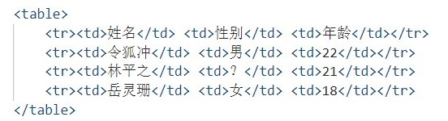

# HTML
## 1 网页
### 1.1 网页
网站是网页的集合。
网页是网站的一页，是HTML格式的文件，通过浏览器阅读。
网页：图片、链接、文字、声音等。
### 1.2 HTML
超文本标记语言（超越了文本的限制，可以加入超链接），不是编程语言，是文本语言，由各种标签组成。
## 2 浏览器
### 2.1 常用浏览器
Firefox，Chrome（主要学习），Safari，Opera.
### 2.2 浏览器内核
即渲染引擎。
Safari使用Webkit内核。Chrome、Opera使用Blink内核。
## 3 Web标准
由W3C制定，主要包括结构、表现、行为三个方面，三个方面彼此分离：
- 结构：用于对网页元素进行整理和分类，现阶段主要学习HTML。
- 表现：用于设置网页元素的版式、颜色、大小等微观样式，主要指CSS。
- 行为：网页模型的定义以及交互的编写，现阶段学习JS。
## 4 HTML
### 4.1 语法规范
- 标签在<>中，一般成对出现。双标签：\<html> \</html>，单标签：\ 。
- 标签有两种关系：包含、并列。
### 4.2 基本结构标签

### 4.3 开发工具
VSCode
## 5 DOCTYPE、lang语言和charset字符集
- DOCTYPE：文档类型声明，在第一行，不是html标签，是文档类型声明标签。
- lang：language的缩写，"en"指的是English，"zh-CN"中文，但是内容中英文都可以写。
- charset：即字符集，UTF-8万国码。
## 6 HTML常用标签
- 标题标签：\<h1>这是第一级标签\</h1>，共有6级。
- 段落：\
.
- 换行：**单标签**\ 
- 粗体：\<b>或者\<strong>
- 斜体：\<i>或者\<em>
- 删除线：\<s>或者\<del>
- 下划线：\<u>或者\<ins>
- 大盒子：\
，一行只能放一个，用于布局。
- 小盒子：\，一行可以放多个，用于布局。
- **图片：**单标签**\**
    - src：必须属性
    - alt：图片显示不出来的时候的文字替代
    - title：鼠标放上面的时候出现的提示文字
    - width：宽度。height：高度（只改一个的时候会等比例缩放，很好）
    - board：边框粗细
- **超链接：\<a href="跳转目标" target="目标的窗口弹出方式"/>**
    - _self当前窗口
    - _blank新窗口
    - href包括外部链接和内部链接
    - href里面放\#代表空链接
    - href里面是压缩包，则下载，这样的链接是下载链接
    - 图片什么的也可以作为超链接
    - 锚点链接，定位到页面的某个位置
- 注释标签：\<!--xxxxxxx-->，快捷键ctrl+/
- 空格：\&nbsp;
- 小于号：\&lt
- 大于号：\&gt
- **表格：**
- 
  -  
  -  表头：\<th>
  -  对齐方式：align="center"/"left"/"right"
  -  边框：border="1"
  -  文字与边框间距：cellpadding="10"
  -  单元格间距：cellspacing="0"
  -  宽高：width，height
  -  头部：\<thead>
  -  身体：\<tbody>
  -  合并单元格：跨行rowspan（上下合并），跨列colspan（左右合并），rowspan/colspan = "合并单元格的个数"，跨行在最上侧写合并代码，跨列在最左侧写合并代码。<th colspan = "6"></th>.最后记得删除多余的表格。
- **列表：无序列表，有序列表，自定义列表**
  - **无序列表**(Unordered list)：\<ul>\<li>
    - \<ul>内只能放\<li>，\<li>里面可以放所有标签
  - **有序列表**(Ordered list)：\<ol>\<li>
    - \<ol>内只能放\<li>，\<li>里面可以放所有标签
  - **自定义列表**(Definition list)：小标题+几个小弟\<dl>\<dt>\<dd>
    - \<dl>内只能放\<dt>\<dd>，\<dt>\<dd>里面可以放所有标签
- **表单标签：收集用户信息**
  - 分为表单域、表单控件（表单元素）、提示信息。
  - 表单域：\<form>收集和传递域内的用户信息
    - **action**: 指定接收并处理信息的服务器程序的url
    - **method**: 设定表单数据的提交方式，get/post
    - **name**: 指定表单的名称，以区分一个页面内的第一个表单域
  - 表单元素
    - **\<input>**: 输入表单元素。**单标签**\<input type="属性值">
      - type: 属性值包含text, password, radio, checkbox, submit, reset, button, file
      - name: 定义名称，注意radio和checkbox这种type的name相同
      - value: 规定元素值，给后台看
      - checked: 默认打开页面就选中, checked="checked"
      - maxlength: 最大字符串长度
    - **\<label>**: 用于绑定某个表单元素。
      - 点击\<label>内的文本时，浏览器会自动将光标选中对应的表单元素上，提高用户体验。
      - \<label for="sex">男\</label>\<input type="radio" name ="sex" id="sex">
      - \<label>中的for和\<input>中的id一样。
    - **\<select>**: 下拉表单元素。\<select>\<option>
      - \<select>里面至少一对\<option>
      - \<option>中selected属性，selected="selected"
    - **\<textarea>**: 文本域。
      - 输入较多的时候使用，如多行文本。
      - rows, cols
## 7 HTML5新增特性（IE 9+, 移动端）
### 7.1 新增语义化标签
- 头部。**\<header>**
- 导航。**\<nav>**
- 内容。**\<article>**
- 定义文档某个区域。**\<section>**
- 侧边栏标签。**\<aside>**
- 尾部标签。**\<footer>**
### 7.2 新增多媒体标签
- 音频。**\<audio>**
- 视频。**\<video>**
### 7.3 新增input表单
type="..."
- email
- url
- date
- time
- month
- week
- number
- tel
- search
- color
### 7.4 新增表单属性
- 必须书写。**required**="required"
- 提示文本。**placeholder**="提示文本", 颜色更改：

      input::placeholder {
             color: pink;
      }

- 自动焦点、**autofocus**="autofocus"
- 下拉产生历史记录。**autocomplete**="off / on"
- 多选文件。**multiple**="multiple"

# CSS
## 1 CSS简介
### 1.1 HTML的局限性
只关注内容的语义，不注重外观。
### 1.2 CSS的优点
CSS是**层叠样式表(Cascading Style Sheets)**，也是一种标记语言。
它使得HTML专注于结构，结构和样式分离。
### 1.3 CSS的语法规范
CSS规则的两个主要部分：**选择器+{一条/多条声明（形式是键值对）}**
写在\<head>的\<style>中。
### 1.4 CSS的代码风格
- 要用展开形式
- 要用小写代码
- 选择器和声明的花括号之间空格，属性与属性值之间的冒号后空格
## 2 CSS基础选择器
### 2.1 标签选择器
所有该标签同一更改样式，如：p {...}
### 2.2 类选择器
差异化选择，选择其中一个或几个，如：.red {...} ...<... class="red">
*样式点定义，结构类调用。
一个或多个，开发最常用。*
类名不要用中文或纯数字，可以查类命名规范。
### 2.3 类选择器-多类名
给一个标签指定多个类名，这些类名都可以选择到这些标签。
- 多个类名之间用空格分开，如：\
\

### 2.4 id选择器
如：#id名 {...} \
\

*样式井定义，结构id调用。
只能用一次，别人勿使用。*
### 2.5 通配符选择器
如：* {...}
改变所有的未被指定的标签。
## 3 CSS字体属性
- 字体种类。**font-family**: 设置各种字体是在第一种无法使用时则用第二种。它们之间以逗号隔开，可以用中文"微软雅黑"，但英文"Microsoft YaHei"兼容性更好。由两个单词组成的字体要用引号引起来。可以直接给body指定。
- 像素大小。**font-size**: \<..px>（谷歌默认16px）
- 字体粗细。**font-weight**: bold，bolder，\<integer>
- 字体风格。**font-style**: normal, italic
- 字体复合属性。**font**: font-style font-weight font-size font-family; 
  - 不可颠倒顺序。
  - 可省略几个属性，但font-size和font-family必须保留
## 4 CSS文本属性
- 颜色。**color**: \<color>, #六位十六进制数字(最常用)，rgb(.., .., ..)
- 水平对齐。**text-align**: center, left, right
- 装饰文本。**text-decoration**: none, underline, overline, line-through 
- 首行缩进。**text-indent**: <..px><..em>，一个em就是一个文字大小。
- 行间距离。**line-height**: <..px>\<percentage>.行间距——文本本身高度+上间距+下间距。
## 5 CSS的引入方式
### 5.1 引入方式
- **内部样式表**：嵌入式。写到HTML标签里面，单独写在style标签里，一般放在head标签里面。结构与样式部分分离。
- **行内样式表**：内联式。\
abcdefg\
. 结构和样式没有分离，比较繁琐。
- **外部样式表**：样式单独写在CSS文件中，需要link标签引入html中。\<link rel="stylesheet" href="address">
### 5.2 chrome调试
按F12或者右键检查，左上角光标图标选择元素，上方代码，下方样式。它不能改代码，只能预览。
## 6 Emmet
### 6.1 Emmet语法
- Emmet语法的前身是Zen Coding，它使用缩写来提高html/CSS的编写速度。
#### 6.1.1 快速生成HTML结构语法
- **生成标签**：标签名，按tab。
- **生成多个标签**：标签名*n，按tab
- **父子级关系的标签**：标签名a>标签名b，按tab
- **兄弟级关系的标签**：标签名a+标签名b，按tab
- **带有类名或者id名的标签**：标签名.类名/#id名，按tab
- **生成类名有顺序的标签**：标签名.类名$*5
- **生成带有文字的标签**：标签名{内容}
#### 6.1.2 快速生成CSS的结构语法
声明：首字母+内容
### 6.2 快速格式化代码
- shift+alt+f
- 或者设置中勾选format on save后，每次ctrl+s保存后自动格式化。
## 7 CSS的复合选择器
### 7.1 后代选择器
元素 后代元素 {样式声明}
- 后代中所有满足的标签都会被选中，不局限于儿子，孙子也会被选中。
- 后代元素可以是子元素也可以是孙子元素，此时需要逐层查找。
- 元素可以是任意基础选择器，除标签选择器外，类和id选择也是可以的。
### 7.2 子选择器
父元素>子元素 {样式声明}
- 只选择儿子，孙子不管。
### 7.3 并集选择器
元素A, 元素B {样式声明}
- 并集选择器喜欢竖着写
- 最后一个选择器不要加逗号
### 7.4 链接伪类选择器
标签名:xxx {样式声明}
xxx：
- link：未访问的链接
- visited：已访问的链接
- hover：鼠标经过的链接，最常用
- active：鼠标正在按下的链接
  
注意：
- 以上四个要严格按照顺序写（**l**o**v**e **ha**te）
- 链接有默认样式，所以链接的样式要单独指定（body里指定没用）
### 7.5 :focus伪类选择器
选取获得焦点的表单元素（被选中的表单元素）。
input:focus {样式声明}
## 8 CSS的元素显示模式
### 8.1 啥是元素显示模式
元素以什么方式显示，如\
自己占一行，\则不是
- **块元素**：\
, \
, \<h>, \<ul>, \<ol>, \<li>
  - 自己独占一行
  - 高度、宽度、外边距以及内边距都可以设置
  - 默认宽度与父亲相同
  - 是一个容器或盒子，里面可以放行内或块元素（任何元素）
  - 文字类的元素内不能使用块元素，如\
内不能放\

- **行内元素**：\, \<strong>, \<b>, \<a>
  - 相邻行内元素在一行上，一行可以显示多个
  - 宽、高设置无效
  - 默认宽度是本身内容宽度
  - 行内元素只能容纳文本或者其他行内元素
  - 链接里不能再放其他链接，但可以再放块元素
- **行内块元素**：\, \<input>, \<td>
  - 和相邻行内元素或行内块元素在一起，在一行内留空隙地显示多个
  - 默认宽度是本身内容的宽度
  - 高度、宽度、外边距以及内边距都可以设置
### 8.2 元素显示模式的转换
引入：\<a>属于行内元素，不可以设置宽度和高度，但比如在电商网站中，为了使得在一个较大范围内使得用户可以点击触发，需要可以设置宽度和高度，这时就需要元素显示模式的转换。
- 转换为块元素：display: block
- 转换为行内元素：display: inline
- 转换为行内块元素：display: inline-block
### 8.3 截图小工具：Snipaste
### 8.4 单行文字垂直居中
没有直接的居中代码。
让文字的行高等于盒子的高度，line-height="height of box"
## 9 CSS的背景
- 背景颜色。**background-color**: \<color>/transparent(default)
- 背景图片。**background-image**: url(); 装饰性的小图片或者非常大的图片。
- 背景平铺。**background-repeat**: no-repeat/repeat-x/repeat-y/repeat(default)
- 背景图片的位置。**background-position**: x y;
  - 方位名词：right, left, center, top, bottom
  - 精确单位：\<...px>
  - 混合单位：很好理解吧
- 背景图片固定。**background-attachment**: fixed
- 背景复合写法。**background**: 没有顺序，一般颜色 地址 平铺 滚动 位置
- 背景色半透明。**background**: rgba(0, 0, 0, 0.3);
## 10 CSS的三大特性
### 10.1 层叠性
解决样式声明冲突的问题
- 就近原则，对于冲突的那行代码，哪个样式离结构近就执行哪个样式的代码
### 10.2 继承性
- 元素继承父元素的样式，主要继承text-，font-，line-的样式和color
- 技巧，父元素的行高设置为1.5，子元素的行高变为当前font-size的1.5倍
### 10.3 优先级
- 选择器相同，则执行层叠性
- 选择器不同，则根据优先级执行。
  
|类别|权重|
|:---:|:---:|
|继承/\*|0,0,0,0|
|标签选择器|0,0,0,1|
|类和伪类选择器|0,0,1,0|
|id选择器|0,1,0,0|
|行内样式|1,0,0,0|
|!important|$\infty$|
- 链接有一个默认的蓝色下划线样式，是标签选择器
- **复合选择器的权重叠加**：后代选择器每一个选择器相加
## 11 CSS盒子模型
页面布局三大核心：盒子模型、浮动和定位
网页布局的本质：
- 先准备好相关的网页元素，网页元素基本都是盒子
- 利用CSS设置好盒子的样式，然后摆放到相应位置
- 往盒子里装内容
### 11.1 盒子模型
- 边框。**border-**: 
  - 粗细。**width**: \<..px>;
  - 样式。**style**: solid / dashed / doted / outset;
  - 颜色。**color**: \<color>;
  - 方位。**top / bottom / left / right**
  - 复合。**border(-top)**: width style color;
  - 细线边框。**collapse**: collapse;
  - **影响实际大小。边框不占用盒子的大小，所以边框较大时，盒子会变大**
- 内边距。**padding-**:
  - 方位。**top / bottom / left / right**: \<..px> 
  - 复合。
    - padding: 5px; 上下左右5px
    - padding: 5px 10px; 上下5px，左右10px
    - padding: 5px 10px 20px; 上5px，左右10px，下20px
    - padding: 5px 10px 20px 30px; 上右下左分别（顺时针）
  - 影响实际大小。加了一个内边框，书写文字的地方才是盒子的大小
  - 不指定width的时候，padding不会影响实际大小，孩子继承也属于没有指定width
  - 行内元素只设置左右内边距
- 外边距。**margin-**: 
  - 方位。同padding
  - 复合。同padding
  - 影响实际大小。
  - 典型应用————块元素水平居中。
    - 盒子指定了宽度width
    - 盒子的左右外边距都设置为**auto**
    - 对于行内元素和行内块元素，为其父元素设置text-align: center;
  - 嵌套块元素垂直外边距的塌陷
    - 为父元素指定上边框
    - 为父元素指定内边距
    - 为父元素添加overflow: hidden(这种方案不会使盒子大小改变)
  - 行内元素只设置左右外边距
- 清除内外边距。**\* {padding="0"; margin="0";}**
- 内容。**content**
### 11.2 圆角边框(CSS3)
圆角边框。**border-radius**: \<..px> \<..%> (宽度和高度的比例)
### 11.3 盒子阴影(CSS3)
盒子阴影。**box-shadow**: h-shadow v-shadow (blur spread color inset)
- 盒子阴影不占用盒子的空间
### 11.4 文字阴影(CSS3)
文字阴影。**text-shadow**: h-shadow v-shadow (blur color)
## 12 浮动
### 12.1 传统网页布局的三种方式
- 普通流（标准流）
- 浮动
- 定位
### 12.2 浮动
#### 12.2.1 基本
1. float属性用于创建浮动框，将其移动到一边，直到左边缘或右边缘触及包含块或另一个浮动框的边缘。
2. 浮动可以改变元素标签默认排列方式
3. 最典型应用：多个块元素在一行内排列显示
4. **网页布局第一准则：块级元素纵向排列找标准流，块级元素横向排列找浮动**
#### 12.2.2 语法
选择器 {float: 属性值;}
- none
- left
- right
#### 12.2.3 浮动的特性
- 浮动元素会脱离标准流（脱标）
  - 浮动的盒子不再保留原来的位置
- 如果盒子都设置了浮动，则它们会按照属性值一行内显示并且顶端对齐
- 浮动元素会具有行内块元素的特点，但是之间不留空隙，宽度由内容决定
#### 12.2.4 浮动元素经常搭配标准流的父元素
先用标准流的父元素排列上下位置，之后内部子元素采取浮动排列左右位置，符合网页布局第一准则。
**网页布局第二准则：先设置盒子的大小，再设置盒子的位置**
#### 12.2.5 清除浮动
- 原因：由于父盒子在很多情况下不方便给高度，但是子盒子浮动又不占有位置，最后父盒子高度为0时，就会影响下面的标准流盒子。
- 本质：清除浮动元素造成的影响。清除浮动后，父级就会根据浮动的子盒子自动检测高度。父级有了高度，就不会影响下面的标准流了。
- 语法：选择器 {clear: 属性值;}
  - left
  - right
  - both
- 额外标签法。在浮动孩子的最后额外加一个块级标签，给定样式 {clear: both;}
- 父元素添加overflow法。父元素加样式 {overflow: hidden}
- after伪元素法。很麻烦，没记
- 双伪元素清除浮动。更麻烦，没记
## 13 PS切图
### 13.1 常见的图片格式
- jpg格式。色彩信息保留较好，产品类图片经常用。
- gif格式。色彩简单，可以保存透明背景和动画。
- png格式。较为清晰，能够保持背景透明。
- PSD格式。PS专用格式，可以直接从上面复制文字，获得图片，测量大小和距离。
### 13.2 几种切图方法
## 14 页面制作思路
### 14.1 属性书写顺序
1. 布局定位属性：display / position / float / clear / visibility / overflow
2. 自身属性：width / height / margin / padding / border / background
3. 文本属性：color / font / text-decoration / text-align / vertical-align / vertical-align / white-space / break-word
4. 其他属性：content / cursor / border-radius / box-shadow / text-shadow / background:linear-gradient...
### 14.2 页面布局思路
1. 确定页面版心宽度。
2. 分析每一个行模块，再分析每一个行模块里的列模块。（第一准则）
3. 一行中的列模块通常是浮动的，先确定浮动模块大小，再确定位置。（第二准则）
4. 先有结构，再有样式。
### 14.3 注意
1. 导航栏用li + a来做
2. a搞一个左右的padding使得每一个a的文字左右，无论文字有多少，都空出相同的距离
3. li搞一个左右的margin来撑开左右距离
4. a是行内元素，不能指定高度
## 15 定位
### 15.1 定位的必要性
定位可以让盒子自由地在某个盒子内移动位置或者固定在屏幕中的某个位置，并且可以压住其他盒子。
### 15.2 定位的组成
定位=定位模式+边偏移
- 定位模式。**position**:
  - 静态定位。**static**. 标准流，很少用
  - 相对定位。**relative**. 
    - 参照原来的位置
    - 原位置保留，不脱标
  - 绝对定位。**absolute**. 
    - 以祖先元素为准。
    - 如果没有祖先元素或者祖先元素没有定位，则以浏览器为准定位。
    - 如果祖先元素有定位（相对、绝对、固定），则以最近的有定位祖先元素为准定位。
    - 绝对定位不保留原来的位置，脱标。
    - 小技巧：定位在父盒子的中心。不能直接margin: 0 auto; 需要left: 50%; margin-left: -0.5*width_self
    - **子绝父相**
  - 固定定位。**fixed**. 
    - 固定于浏览器可视区的位置，浏览器页面滚动时不动。
    - 以浏览器可视窗口为准定位。
    - 跟祖先元素没关系。
    - 不占有原来的位置，脱标。
    - 小技巧：贴在版心右侧定位。left: 50%; margin-left: 0.5*width_w
  - 粘性定位。**sticky**.
    - 相对定位和固定定位的结合。
    - 以浏览器的可视窗口为准。
    - 保持原来的位置，不脱标。
    - 必须要指定上下左右中的一个。
- 边偏移。
  - 顶部。**top**: \<..px>
  - 底部。**bottom**: \<..px>
  - 左侧。**left**: \<..px>
  - 右侧。**right**: \<..px>
### 15.3 定位的叠放顺序
**z-index**: \<..>. 
- 越大越靠上。
- 属性值相同时，按书写顺序，后来者居上。
- 只有定位的盒子才有这个属性，标准流和浮动没有。
### 15.4 定位的特殊性质
- 行内元素或块元素定位之后，有了行内块元素的性质，可以直接给定宽度和高度。
- 浮动会脱标，压住下面标准流的盒子，但不会压住盒子里的文字和图片。（方便做文字环绕效果）
- 绝对和固定定位也会脱标，但是会压住下面的标准流的所有内容。
### 15.5 网页布局总结
大部分html标签是一个盒子。
通过CSS浮动、定位可以让每个盒子排列成网页。
垂直的标准流用标准流布局。
多个块级盒子水平对齐就用浮动布局。
元素在某个盒子内自由移动就用定位布局。
## 16 元素的显示与隐藏
### 16.1 display属性
隐藏对象。**display: none;**
- 不保留原来位置
  
显示元素。**display: block; (搭配JS食用，重要！！！)**
### 16.2 visibility属性
隐藏对象。**visibility: hidden;**
- 保留原来位置

显示元素。**visibility: visible;**
### 16.3 overflow属性
溢出部分隐藏。**overflow: hidden;**
溢出部分显示滚动条。**overflow: scroll;**（不溢出也显示滚动条）
溢出部分在需要的时候显示滚动条。**overflow: auto;**
显示元素。**overflow: visible;**
## 17 精灵图
### 17.1 精灵图的意义
减少浏览器向服务器的请求次数。在浏览器请求图片a时，服务器把包含图片a的一大张图片全部发给浏览器，当浏览器需要其他图片时，先检查那一大张图片里是否包含需要的图片，如果包含则不需向服务器请求。
### 17.2 精灵图的使用
1. 精灵图主要针对背景图片使用，就是把多个小背景图片整合到一张大图片中。
2. 这个大图片就叫精灵图（雪碧图）。
3. 移动图片的位置，可以用background-position.
4. 移动的距离即目标图片的x, y坐标，一般为负值。（坐标正方向参考华为小车。。。）
### 17.3 精灵图的代码实现

    .box {
      width: 60px;
      height: 60px;
      margin:100px auto;
      background: url(...) no-repeat -180px 0;
    }
## 18 小技巧们
### 18.1 字体图标
#### 18.1.1 概念
网页中通用的小图标。
不用精灵图，因为大小比较大，放大失真，更换麻烦。
看上去是图标，实际上是文字。轻量级，灵活性。 
#### 18.1.2 字体图标的使用
没成功
### 18.2 CSS三角
盒子无大小，边框全透明，想要朝向哪边的三角，就把反方向的边框改为想要的颜色。利用好子绝父相。
### 18.3 用户界面
#### 18.3.1 鼠标样式
{cursor: ...;}
- 默认。**default**
- 小手。**pointer**
- 移动。**move**
- 文本。**text**
- 禁止。**not-allowed**
#### 18.3.2 取消表单轮廓和防止拖拽文本域
- 取消表单轮廓线。**{outline: none;}**
- 防止拖拽文本域。**{resize: none;}** 文本域在html里最好放在一行里。
### 18.4 行内块（如图片）和文字垂直居中对齐
{vertical: ...;}
- 基线。**baseline** 默认对齐方式
- 中线。**middle** 最常用对齐方式
- 底线。**bottom**
- 顶部。**top**
### 18.5 图片底侧有空白空隙解决方案
形成原因：行内块元素中图片是和基线对齐的。
解决方案：
- vertical-align: bottom / middle / top; 推荐。
- display: block; 行内块元素转换为块元素。
### 18.6 溢出文字的省略号表示
1. 单行文本溢出显示省略号，必须满足三个条件：
- 先强制一行内显示文本。white-space: nowrap; （默认normal自动换行）
- 超出的部分隐藏。overflow: hidden;
- 文字用省略号代替溢出的部分。text-overflow: eclipse;
2. 多行文本溢出显示省略号，必须满足三个条件：
- overflow: hidden;
- text-overflow: eclipse;
- display: -webkit-box;
- -webkit-line-clamp: 2;
- -webkit-box-orient: vertical;
## 19 常见布局技巧
### 19.1 margin负值的应用
两个盒子都有1px的border，假如添加了浮动，则会紧挨在一起，中间的border为1+1=2px，不好看。所以添加margin-left=-1.
产生问题：想要hover使得border有其他效果时，右侧边框不会改变，hover添加相对定位。若本身就有定位（如父元素有相对定位），则提高层级，z-index: 1;
### 19.2 文字围绕浮动元素巧妙运用
图片左浮动，文字不会被压住。
### 19.3 行内块元素的巧妙运用
上一页 1 2 3 ... 下一页
这种东西用行内块来做
## 20 CSS初始化
## 21 CSS3新增特性
### 21.1 新增选择器
- 属性选择器。(权重为10)
  - **E[att] {...}** 选中E类中具有att属性的。
  - **E[att="val"] {...}** 选中E类中att属性值为"val"的。**重要！**
  - **E[att^="val"]{...}** 选中E类中att属性值以"val"开头的。
  - **E[att$="val"]{...}** 选中E类中att属性值以"val"结尾的。
  - **E[att\*="val"]{...}** 选中E类中att属性值含有"val"的。