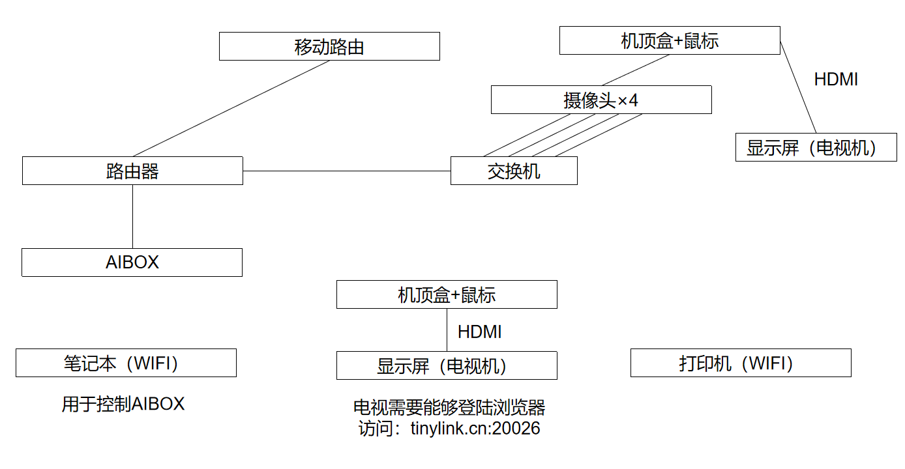

# 杭电信工-淘工厂项目
## 1 2022-11-28前期准备
### 1.1 线路部署

### 1.2 相关细节
- 摄像头连接交换机的PoE口，使用网线完成供电
- 出厂化设置的路由器如何配置？
  1. 使用笔记本连接该路由器对应网络。
  2. 访问192.168.1.1，设置路由器管理员密码（用于登陆路由器控制台），设置WiFi名称和WiFi密码（用于普通用户使用WiFi）。**发现4个摄像头的ip均为192.168.1.64，原因：未激活**
- 摄像头激活
  1. 按照说明书，输入192.168.1.64