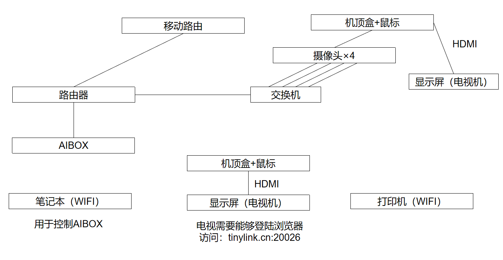

# 浙大-阿里-淘工厂———莆田项目
## 1. 主要设备
- 验布机
- 4个传送带
- 红外传感器 + PLC
- 4个摄像头
- 移动路由 + 一组路由器
- AI-BOX
- 2个电视
## 2. 日程安排
### 11.20
18:00抵达莆田，20:00完成frp的学习和简单部署，赵子涵模拟次日钉钉小程序的试运行，工作直至次日凌晨1点结束。
### 11.21
8:00左右抵达莆田学院中校区，上午安装四个传送带，师兄帮忙完成了frp的部署和摄像头以及AI-BOX等的连接。
12:00-14:00午饭 + 午休
下午和晚上在其中一个传送带上安装PLC和红外传感器。刘赵小程序debug.
### 11.22
上午完成验布机的调整，现场工作收尾
## 3. 所遇问题
1. 接线出现低级错误，三股电线的铜丝裸露部分用热缩套短接在了一起，红外传感器疑似烧坏。
2. 激光传感器的线路连接图正确性存疑。
## 4. 线路部署
